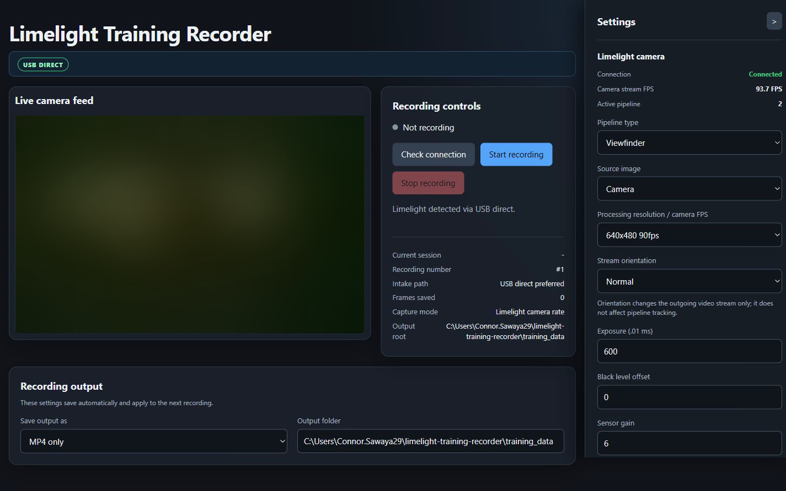

# Limelight Training Recorder

Small, local control panel for recording Limelight 3A training data over the camera's USB-C network connection.

It records the camera stream with FFmpeg and can save an MP4, JPG frames, and/or a ZIP of the JPGs. The project uses only Python's standard library; FFmpeg is the only runtime dependency.

**Quick links:** [Open the local dashboard](http://127.0.0.1:8080/) · [Windows setup](windows/setup_windows.bat) · [macOS/Linux setup](macos-linux/setup.sh) · [Run the tests](tests/)

The dashboard link works after starting the local web interface; GitHub cannot run the local recorder inside the repository page.



## How it works

```text
Limelight 3A over USB-C
        │
        ├─ direct USB MJPEG feed (preferred)
        │       └─ FFmpeg
        │              ├─ recording.mp4
        │              └─ frames/frame_000001.jpg ...
        │
        └─ hostname MJPEG proxy (backup only)
```

The dashboard automatically checks the known Limelight USB-network addresses. It records directly from the camera whenever possible and displays `USB DIRECT` or `PROXY BACKUP` so the intake path is always clear. The camera's own resolution setting controls its available FPS; the recorder preserves every incoming frame for dashboard recordings.

## One-line setup

Paste one command into a terminal. No git required: it downloads the project, checks Python 3.10+, and installs FFmpeg if missing.

Run the same installer again later to update an existing Git checkout before setup runs.

**Windows** (PowerShell):

```powershell
irm https://raw.githubusercontent.com/ConnorSawaya/limelight-training-recorder/main/install/install.ps1 | iex
```

**macOS / Linux** (Terminal):

```bash
curl -fsSL https://raw.githubusercontent.com/ConnorSawaya/limelight-training-recorder/main/install/install.sh | bash
```

Or, if you prefer to clone it yourself:

```text
git clone https://github.com/ConnorSawaya/limelight-training-recorder.git
```

Then run `windows\setup_windows.bat` on Windows or `macos-linux/setup.sh` on macOS/Linux.

## Quick setup

1. Install **Python 3.10+** if it is not already installed ([Windows](https://www.python.org/downloads/windows/), `brew install python` on macOS). Windows setup can install Python via `winget`.
2. Connect the Limelight 3A's USB-C communication port directly to the computer with a data-capable USB-C cable. **Do not hold the blue configuration button** while plugging in; that puts the camera into flash mode.
3. Wait ~20 seconds for the Limelight to boot and for the USB network connection to appear.
4. Run setup once: double-click **`windows\setup_windows.bat`** on Windows, or run **`macos-linux/setup.sh`** on macOS/Linux.

## Repository layout

```text
limelight_recorder.py    Core recorder CLI (Windows, macOS, Linux)
web_interface.py         Local browser control panel
install/                 One-line installers (install.ps1, install.sh)
windows/                 Windows setup and batch launchers
macos-linux/             macOS/Linux setup and launchers
tests/                   Standard-library unit tests
tools/                   Project-local FFmpeg (created by setup, git-ignored)
training_data/           Recorded sessions (created when recording, git-ignored)
```

## Record from the dashboard

1. Plug the Limelight 3A directly into the computer with a data-capable USB-C cable.
2. Wait for it to boot and for the USB network adapter to appear.
3. Start the dashboard with the launcher for your platform.
4. Click **Check connection**, choose the camera feed, and click **Start recording**.
5. Click **Stop recording**. The session is finalized before the button becomes available again.

The output choices and output folder are in the full-width panel at the bottom of the dashboard and save automatically. Limelight camera settings remain in the right sidebar; click **Save to Limelight** after changing a device setting.

### Windows

Run setup once by double-clicking `windows\setup_windows.bat`, then double-click `windows\start_web.bat`.

### macOS / Linux

Run setup once:

```bash
bash macos-linux/setup.sh
```

Then start the dashboard:

```bash
bash macos-linux/start_web.sh
```

The equivalent command is `python3 limelight_recorder.py web --open-browser`. The other launchers are `start_recorder.sh`, `run_foreground.sh`, `stop_recorder.sh`, and `status_recorder.sh`.

## Record from the command line

The `*.bat` launchers are Windows-only. On macOS/Linux use `python3` instead of `py -3`.

| Action | Windows (double-click) | Command line |
| --- | --- | --- |
| Start (background, 3 FPS) | `windows\start_recorder.bat` | `py -3 limelight_recorder.py start --fps 3` (macOS/Linux: `python3 …`) |
| Stop and finalize | `windows\stop_recorder.bat` | `py -3 limelight_recorder.py stop` |
| Check status | `windows\status_recorder.bat` | `py -3 limelight_recorder.py status` |
| Watch in console | `windows\run_foreground.bat` | `py -3 limelight_recorder.py start --foreground` |

## Browser interface

The control panel opens at:

```text
http://127.0.0.1:8080/
```

The page shows the live MJPEG feed and reads and writes Limelight camera settings (resolution/FPS, exposure, gain, orientation, flicker correction, white balance) directly on the device. Use **Camera feed to record** to choose the raw camera image or the processed overlay image. There is no URL to configure: the dashboard detects the camera automatically.

The Limelight MJPEG stream does not include frame timestamps. The dashboard reads the selected camera resolution and passes its real input rate (90, 40, or 10 FPS) to FFmpeg so saved MP4 files are not mislabeled with FFmpeg's 25 FPS default. CLI recordings use frame-arrival timestamps when the camera rate is not available.

The camera labels follow the Limelight 3A controls: exposure is in `.01 ms`, black-level offset is `0–40`, sensor gain is `1–45`, and red/blue balance are `500–2500`. Stream orientation affects the outgoing video image only; it does not change pipeline tracking.

The server binds to `127.0.0.1`, so it is only reachable from this computer. If port 8080 is taken, use another:

```text
py -3 limelight_recorder.py web --port 8090 --open-browser
```

(On macOS/Linux: `python3 limelight_recorder.py web --port 8090 --open-browser`.)

## Recording options

```text
py -3 limelight_recorder.py start --max-fps                     # every incoming frame
py -3 limelight_recorder.py start --fps 10                      # sample at 10 FPS
py -3 limelight_recorder.py start --output-mode mp4             # MP4 only
py -3 limelight_recorder.py start --output-mode images_zip      # JPGs + frames.zip
py -3 limelight_recorder.py start --host 172.26.0.1 --fps 3     # manual camera IP
```

(On macOS/Linux use `python3 limelight_recorder.py …`.)

* `--fps` accepts any value greater than 0 up to 120. The camera stream itself sets the hard FPS ceiling.
* `--max-fps` saves every frame the camera delivers.
* Output modes: `both` (default), `mp4`, `images_zip`, `both_zip`.
* ZIP output is created as `frames.zip` when recording stops; the individual JPGs remain in the session's `frames` folder.

## Output

Each run creates a numbered, timestamped folder under `training_data`. This makes back-to-back recordings easy to tell apart:

```text
training_data/
  limelight_raw_data_20260912_143015_01/
    recording.mp4
    frames/
      frame_000001.jpg
      frame_000002.jpg
    frames.zip             (when a ZIP output mode is selected)
    metadata.json
    ffmpeg.log
  limelight_raw_data_20260912_143022_01/
    ...                     (the next recording)
```

If two sessions start in the same second, the final number increments to `_02`, `_03`, and so on. Overlay sessions use the `limelight_overlay_data_...` prefix. `metadata.json` records the session name, recording number, stream URL, intake mode, capture mode, input FPS/timing mode, output mode, timestamps, and output counts.

## Camera detection

The recorder probes the direct USB-network addresses on port `5802`, preferring `172.28.0.1`, and then the Limelight hostnames. It verifies the endpoint is an MJPEG stream before starting FFmpeg. The dashboard can use its local MJPEG proxy as a backup only when the direct USB feed cannot be reached.

Verify the connection in a browser:

```text
http://limelight.local:5801
http://172.26.0.1:5801
http://172.28.0.1:5801
```

The Limelight's raw camera stream is on port `5802`; the normal processed/overlay stream is on port `5800`, and its web interface is on port `5801`. For a custom/static address from the command line, pass `--host <IP>` or use `--stream-url <URL>`.

## Troubleshooting

* **No Limelight camera stream was detected**: make sure the camera is powered, fully booted, and connected with a USB-C data cable. Try the browser URLs above, then use `--host` if the web interface works at another address.
* **Camera shows as a flash/storage device**: unplug it, do not hold the configuration button, and reconnect.
* **FFmpeg was not found**: run setup again (`windows\setup_windows.bat` or `macos-linux/setup.sh`), or install FFmpeg and add it to PATH.
* **A recording is already running**: stop it first with `windows\stop_recorder.bat`, `macos-linux/stop_recorder.sh`, or the dashboard's **Stop recording** button. The next start creates a new numbered session folder.
* **Debugging**: inspect `ffmpeg.log` inside the newest session folder.

## Tests

```text
py -3 -m unittest discover -s tests -v
```

On macOS/Linux: `python3 -m unittest discover -s tests -v`.
